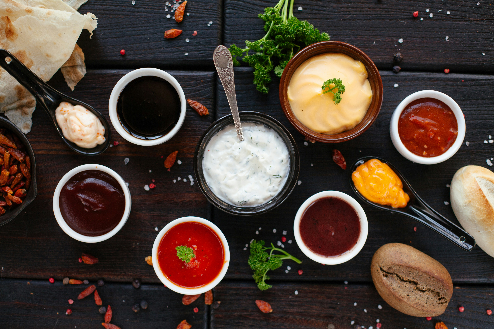

# Menu

## Pizze

|Lp.|Pizza                                                                            |rozmiar | 30cm | 50cm | 60cm |
|---|---------------------------------------------------------------------------------|--------|------|------|------|
|1. |KLASYCZNA (sos pomidorowy, ser, oregano)                                         |        |28 zł |48 zł |58 zł |
|2. |PEPPERONI (sos pomidorowy, ser, salami pepperoni)                                |        |32 zł |52 zł |62 zł |
|3. |BUFALA (sos pomidorowy, ser, ser bufala)                                         |        |38 zł |58 zł |68 zł |
|4. |IMPERIAL (sos pomodorowy, 2x ser, salai pepperoni, cebula, bekon, szynka)        |        |42 zł |62 zł |72 zł |
|5. |BOLOGNE (sos pomidorowy, klopsiki)                                               |        |35 zł |55 zł |65 zł | 
|6. |VEGGIE (sos pomidorowy, ser, mix sałat, oregano)                                 |        |32 zł |52 zł |62 zł |
|7. |CAPRICCIOZA (sos pomidorowy, ser, szynak, pieczarki)                             |        |35 zł |55 zł |65 zł |
|8. |BOLONIA (sos pomidorowy, ser, szynka, pieczatki, papryka)                        |        |40 zł |60 zł |70 zł |
|9. |RZEŹNIK (sos pomidorowy, ser, bekon, cebula, kabanos, salami, szynka, papryka)   |        |42 zł |62 zł |72 zł |
|10.|SPINACCI (sos śmietanowy, ser, brokuły, kebab, szpinak)                          |        |42 zł |62 zł |72 zł |

## Sałatki

|Lp.|Sałatka                                                                                      |gramatura|cena     |
|---|---------------------------------------------------------------------------------------------|---------|---------|
|1. |GRECKA (mix sałat, pomidor, ogórek, cebula, ser feta, oliwki, rucola, sos vinegrette)        | 450 g   |  25 zł  |
|2. |CEZAR (mix sałat, kebab, bekon, pomidor, ogórek, cebula, cebulka prażona, sos serowy-chilli) | 450 g   |  25 zł  |
|3. |KEBAB (mix sałat, kebab, pomidor, ogórek, cebula, sos czosnkowy)                             | 450 g   |  25 zł  |
|4. |SPINACCI (mix sałat, świeży szpinak, suszone pomidory, ser feta, cebula, oliwa z oliwek)     | 450 g   |  25 zł  |

## Sosy

1. Sos pomidorowy - 4 zł
2. Sos czosnkowy - 4 zł
3. Sos 1000 wysp - 4 zł
4. Sos bbq - 4 zł
5. Sos duński - 4 zł
6. Sos arabski - 4 zł
7. Ketchup - 4 zł

## Napoje

1. Woda 0.5L - 5 zł
2. Pepsi 0.5L - 8 zł
3. Sprite 0.5L - 8zł
4. Fanta 0.5L - 8 zł
5. Lipton 0.5L - 8 zł
6. Cola Zero 0.5L - 8 zł
